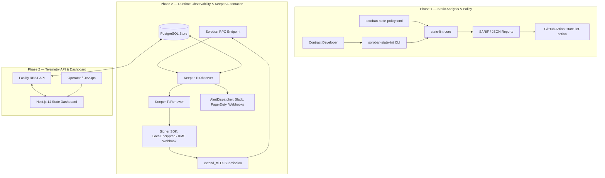

# Architecture Overview — `soroban-state-ops`

`soroban-state-ops` is an end-to-end storage lifecycle and safety platform for smart contracts deployed on the Stellar network (Soroban Protocol 20/21).

## System Architecture

## Component Breakdown

### 1. Rust Toolchain (`crates/`)
- **`crates/state-policy`**: Core parser and domain models for `soroban-state-policy.toml` manifests. Enforces valid storage tiers, criticality ratings, TTL modes, and recovery strategies.
- **`crates/state-lint-core`**: AST visitor and static analyzer engine. Analyzes Soroban smart contract Rust source code for storage anti-patterns, missing `extend_ttl` calls, and unsafe storage tier assignments.
- **`crates/soroban-state-lint`**: High-performance CLI tool providing `check` and `rules` subcommands with colored terminal output and SARIF 2.1.0 output.
- **`crates/state-fixtures`**: Test fixtures covering unsafe and safe contract patterns for regression testing.

### 2. TypeScript Toolchain & SDKs (`packages/`)
- **`packages/shared-types`**: Zod schemas and runtime validation types mirroring Rust policy models.
- **`packages/lint-npm`**: `@soroban-ops/lint` wrapper allowing developers to install and run the linter via npm/npx.
- **`packages/github-action`**: Ready-to-use GitHub Action for automated CI checks and code scanning integration.
- **`packages/signer-sdk`**: Pluggable transaction signing abstraction. Includes AES-256-GCM local encrypted key signing and enterprise KMS external webhook integration.
- **`packages/keeper`**: Autonomous TTL monitoring and renewal daemon. Runs RPC polling loops, tracks ledger counters, evaluates thresholds, and submits `extend_ttl` operations.
- **`packages/api`**: Fastify REST API providing endpoints for contract registration, TTL history, alert feed, and storage rent calculations.
- **`packages/dashboard`**: Next.js 14 web application featuring glassmorphism design, real-time TTL gauges, contract explorer, alert feed, and interactive rent calculator.

### 3. Infrastructure (`infra/`)
- **`infra/migrations`**: PostgreSQL schema for contracts, state keys, snapshots, alert logs, and keeper job queue.
- **`infra/compose`**: Docker Compose orchestration uniting PostgreSQL, keeper, API, and dashboard.
- **`infra/docker`**: Optimized multi-stage Dockerfiles for keeper, API, and Next.js dashboard.
