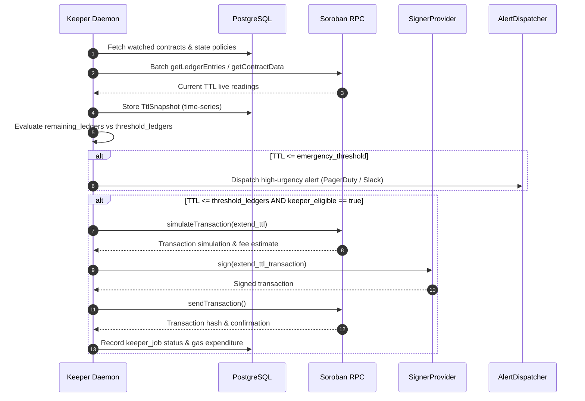

# Keeper Service Architecture & Operational Guide

The `@soroban-ops/keeper` package is an automated background daemon responsible for maintaining live state TTL buffers across registered Soroban contracts.

## Polling & Decision Engine

The keeper loop executes on a periodic interval (`KEEPER_POLL_INTERVAL_MS`, default: 60s):

## Signer Security Architecture

The keeper never handles unencrypted private keys in configuration files:
- **Development / Self-Hosted**: Uses `LocalEncryptedKeySigner` which decrypts an AES-256-GCM ciphertext in memory upon startup using a passphrase stored in environment variables.
- **Enterprise / Production Multi-Tenant**: Uses `ExternalWebhookSigner` to delegate transaction signing to external signing services (such as Fireblocks, Turnkey, or HashiCorp Vault) via secure HMAC/Bearer webhooks.

## Alerting & Deduplication

Alerts dispatched by `AlertDispatcher` are deduplicated per `(contract_id, key_name, alert_type)` with a 5-minute sliding cooldown window to prevent alert fatigue during sustained RPC outages or rapid ledger spikes.
